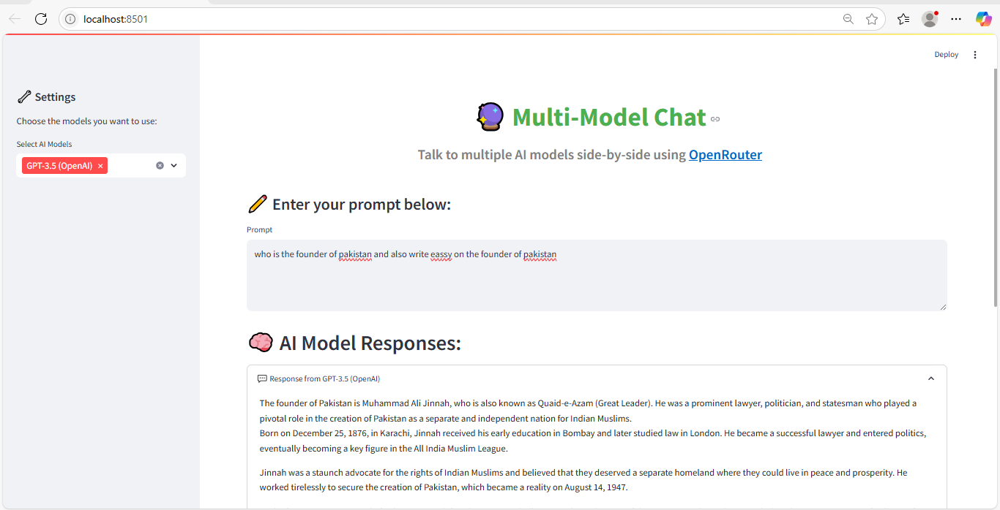

````markdown
# 🤖 Multi-Model Chatbot with OpenRouter + Streamlit

This is a Streamlit-based chatbot app that allows users to interact with multiple powerful language models (LLMs) using the [OpenRouter](https://openrouter.ai/) API. The app takes a user prompt and returns responses from **five different AI models** side-by-side.

---

## 📸 Demo

 <!-- (Optional: Replace or remove this line if you don't have a screenshot yet) -->

---

### 🚀 Live Demo  
👉 [Click here to launch the app on Streamlit](https://share.streamlit.io/hibasharif/uv_streamlit_chatbot/main/uv_app.py)

---

## 🚀 Features

- 🌐 Supports multiple models via OpenRouter:
  - `openai/gpt-4`
  - `anthropic/claude-3-opus`
  - `google/gemini-pro`
  - `meta/llama-3-70b-instruct`
  - `mistralai/mixtral-8x7b`
- 🎨 Clean, interactive Streamlit UI
- 🔁 Real-time parallel responses
- 🔐 Easily configurable via OpenRouter API Key

---

## 🛠️ Technologies Used

- [Streamlit](https://streamlit.io/) – for UI
- [OpenRouter](https://openrouter.ai/) – for connecting to multiple AI models
- [Python](https://www.python.org/) – backend logic

---

## 📦 Installation

### 1. Clone the repository

```bash
git clone https://github.com/hibasharif/uv_streamlit_chatbot.git
cd uv_streamlit_chatbot
````

### 2. Create a virtual environment (optional but recommended)

```bash
python -m venv venv
venv\Scripts\activate  # On Windows
source venv/bin/activate  # On macOS/Linux
```

### 3. Install dependencies

```bash
pip install -r requirements.txt
```

### 4. Add your OpenRouter API key

Replace the placeholder in `app.py`:

```python
API_KEY = "your_openrouter_api_key_here"
```

Or store it as an environment variable and access it using:

```python
import os
API_KEY = os.getenv("OPENROUTER_API_KEY")
```

---

## ▶️ Running the App

```bash
streamlit run app.py
```

The app will launch in your browser at `http://localhost:8501/`

---

## 🧠 How It Works

The app sends your input prompt to OpenRouter for each selected model and displays the responses in parallel. You can easily compare how each LLM responds to the same query.


---

## 🙋‍♀️ Author

**Hiba Sharif**
GitHub: [@hibasharif](https://github.com/hibasharif)
Project for: *UV & OpenRouter Assignment*

---

## 🌐 Links

* 🔗 [OpenRouter API Docs](https://openrouter.ai/docs)
* 🎨 [Streamlit Documentation](https://docs.streamlit.io/)

````

---

### ✅ Save this as `README.md` in your project root directory.

Then commit it:

```bash
git add README.md
git commit -m "Add README for multi-model chatbot project"
git push
````

Would you like a `requirements.txt` and `.gitignore` file next?
